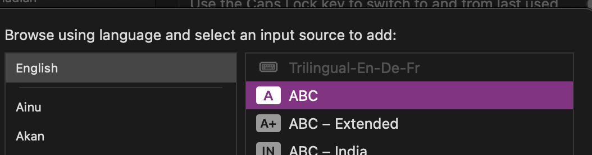

# MacOS Trilingual English, Français, Deutsch keyboard

This keyboard layout is designed to provide Canadians with a single layout for both official languages while also restoring option + umlaut mappings.

Starting from the default MacOS Canadian English layout, additional mappings were added when holding down the option key to type common umlauts and French accents. The layout for French follows the Canadian French layout. Umlauts are placed on the corresponding letters (according to Google, it used to be that way, but now MacOS’s Canadian English maps Scandinavian letters instead).

The Canadian English layout is better for programming than the Canadian French layout and that's just facts.

Contributions welcome, I will not be making a US keyboard version because I'm not familiar with it. Also I personally remapped my Command and Control key so that I can easily switch to Windows and Linux. All this to say this can probably be easily be ported to other platforms.

### Screenshots

- Default state:
  
- Option key held down:
- Shift held down:
  
- Option + Shift:

  

### Installation:

1) Download the .dmg file
2) Open it
3) Click the keyboard installer app
   
4) Select the bundle
5) Install for current user

   
6) you may have to restart your computer
7) Add the input method by selecting english -> trilingual-en-de-fr

   

### Credits:

- This project was made using [Ukulele](https://software.sil.org/ukelele/)
- This project was inspired by MickL's [German Programming Layout](https://github.com/MickL/macos-keyboard-layout-german-programming)
